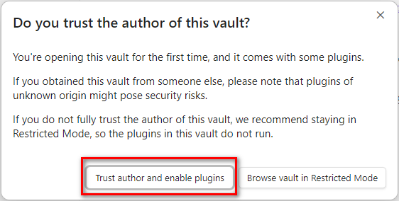
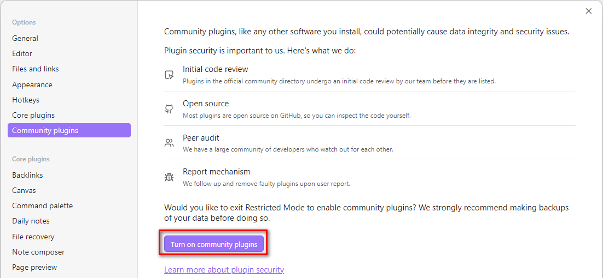

This is an [Obsidian](https://obsidian.md/) vault to demonstrate features of [CodeScript Toolkit](https://github.com/mnaoumov/obsidian-codescript-toolkit/) plugin.

To start using it:

1. [Download](https://github.com/mnaoumov/obsidian-codescript-toolkit-demo-vault/archive/refs/heads/master.zip) zipped vault.
2. Unzip it.
3. In Obsidian → Manage vaults... → **Open folder as vault** → select the unzipped folder.
4. Enable plugins using one of these methods:
    - **Trust author** - to enable plugins immediately.
        
    - **Enable manually** - turn on Community plugins.
        
5. [00 Start](<./00 Start.md>)
